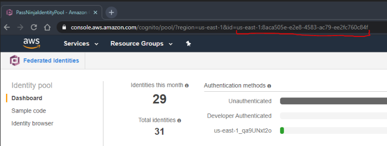

##### Jest Coverage


 
 

# Configuring 

## Prerequisites

```
$ node -v
v8.16.0
$ npm -v
6.4.1
```

## Install Dependencies

Even though the cli is bundled into a single JavaScript file, there are some
native extensions and other modules which are required to be installed
separately.

```bash
npm install
```

### `.env` file
```bash
REGION='us-east-1'
PASS_COM_NDUDFIELD_NFC_PASSPHRASE='zxccxz'
AWS_SDK_LOAD_CONFIG=0
IOT_HOST="a1o5x5ek64x899-ats"
USER_POOL_ID='us-east-1_qa9UNxt2o'
USER_POOL_CLIENT_ID='7hsccetpkumpavofq81ifji292'
IDENTITY_POOL_ID='us-east-1:8aca505e-e2e8-4583-ac79-ee2fc760c84f'
FEDERATION='cognito-idp.us-east-1.amazonaws.com/us-east-1_qa9UNxt2o'
```

### How to source env values (if stale)

|     Env Var    | Value |
|:-------------- |:----- |
|  `FEDERATION`  | AWS Cognito -> Manage User Pools -> passninja-user-pool -> Pool ARN (after "arn:aws:")      |
| `USER_POOL_ID` | AWS Cognito -> Manage User Pools -> passninja-user-pool -> Pool Id      |
| `USER_POOL_CLIENT_ID` | AWS Cognito -> Manage User Pools -> passninja-user-pool -> General Settings -> App clients -> passninja-user-pool-client     |
| `IDENTITY_POOL_ID` | AWS Cognito -> Manage Identity Pools -> PassNinjaIdentityPool -> URL `id` query parameter (see at diagram 1.1)|



<sub>(Diagram 1.1)</sub>

### Build Error Troubleshooting
1.  `Error: config.userPoolId not found`
    
    Make sure both the USER_POOL_ID and USER_POOL_CLIENT_ID are set properly and are not stale above.  

2.  `Error: Invalid login token. Issuer doesn’t match providerName`

    Make sure both the USER_POOL_ID and FEDERATION are set properly and are not stale above.  

## Install drivers

Go to ACS 1255U reader [download page](https://www.acs.com.hk/en/products/403/acr1255u-j1-secure-bluetooth%C2%AE-nfc-reader/)

Download the [pcsc drivers](https://www.acs.com.hk/download-driver-unified/9184/ACS-Unified-Driver-Lnx-Mac-115-P.zip)

## Enable escape commands 

After installing, to enable escape commands you must edit a configuration file
using admin privileges. Once completed the modifications you may need to reboot your
machine for charnges to take effect. 

On OSX:

```bash
sudo nano /usr/local/libexec/SmartCardServices/drivers/ifd-acsccid.bundle/Contents/Info.plist 
```

Edit the `<string>` with  `ifdDriversOptions` `<key>` and set the 
`DRIVER_OPTION_CCID_EXCHANGE_AUTHORIZED` bit:

```
<!-- Possible values for ifdDriverOptions
0x01: DRIVER_OPTION_CCID_EXCHANGE_AUTHORIZED
        the CCID Exchange command is allowed. You can use it through
        SCardControl(hCard, IOCTL_SMARTCARD_VENDOR_IFD_EXCHANGE, ...)
```

eg.

```
<key>ifdDriverOptions</key>
<string>0x0001</string>
```

## e2e testing

To run end-to-end testing:
```
npm run e2e
```

## Run the headless client

From the root directory of the repo run:
```
./bin/start-pn.sh
```

You can setup a background daemon with autostart actions by [following tese instructions.](https://github.com/flomio/flomio_apps_server/wiki/faq15%3A-How-do-I-setup-RPi3-or-PiZero%3F#setup-the-pi-to-autostart) 
